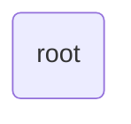
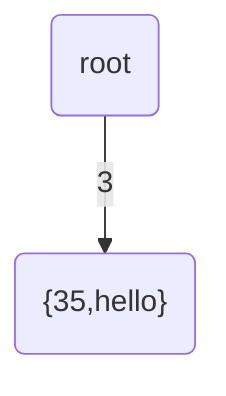
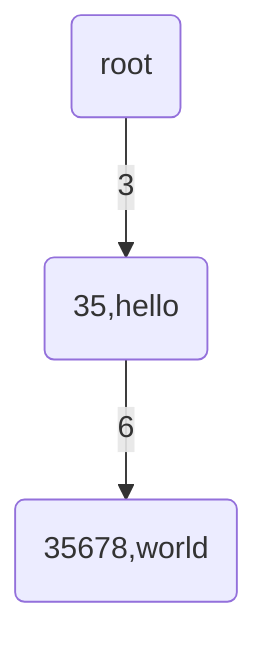
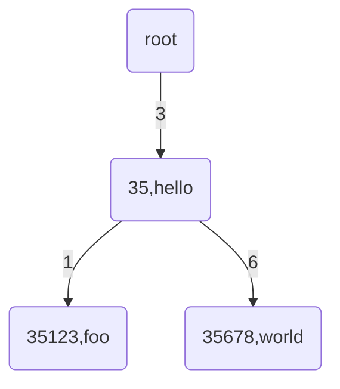
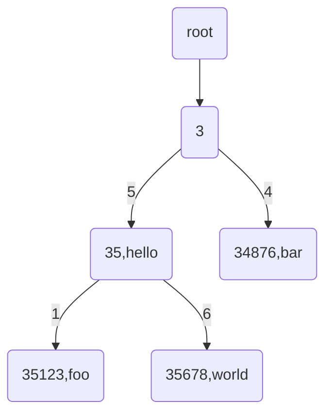

<!-- TOC -->

- [简介](#简介)
- [概念](#概念)
    - [序列化](#序列化)
    - [账号地址](#账号地址)
    - [区块](#区块)
    - [资产](#资产)
    - [BU币](#BU币)
    - [账号](#账号)
    - [交易 transaction](#交易-transaction)
    - [操作 operation](#操作-operation)
        - [创建账号](#创建账号)
        - [发行资产](#发行资产)
        - [转移资产](#转移资产)
        - [转移BU币](#转移bu币)
        - [设置metadata](#设置metadata)
        - [设置权重](#设置权重)
        - [设置门限](#设置门限)
- [交易缓存队列](#交易缓存队列)
    - [队列缓存大小的上限](#队列缓存大小的上限)
    - [交易缓存超时处理](#交易缓存超时处理)
    - [交易在队列中的排序](#交易在队列中的排序)
    - [交易在队列中的插入和删除](#交易在队列中的插入和删除)
    - [交易的打包](#交易的打包)
- [P2P](#p2p)
    - [P2P 设计](#p2p-设计)
    - [广播和组播](#广播和组播)
    - [连接数](#连接数)
- [共识](#共识)
    - [共识节点选举](#共识节点选举)
- [交易事务处理](#交易事务处理)
- [交易费用](#交易费用)
    - [费用基本概念](#费用基本概念)
    - [交易前基本费用计算和检查](#交易前基本费用计算和检查)
    - [费用评估](#费用评估)
    - [费用计算](#费用计算)
    - [费用选举](#费用选举)
- [合约](#合约)
    - [虚拟机特性](#虚拟机特性)
        - [图灵完备性](#图灵完备性)
        - [执行结果一致性](#执行结果一致性)
        - [数据交互性](#数据交互性)
        - [合约可交互](#合约可交互)
        - [权限可分配](#权限可分配)
    - [虚拟机优化](#虚拟机优化)
        - [虚拟机问题](#虚拟机问题)
        - [优化方案](#优化方案)
        - [V8优化实例](#V8优化实例)
    - [合约开发](#合约开发)
        - [合约创建](#合约创建)
        - [合约执行](#合约执行)
        - [合约模板](#合约模板)
        - [合约调试](#优化方案)
        - [内置接口实例](#内置接口实例)
        - [异常处理](#异常处理)
- [账本升级](#账本升级)
    - [简介](#简介)
    - [消息定义](#消息定义)
    - [升级过程](#升级过程)
        - [启动检测](#启动检测)
        - [广播消息](#广播消息)
        - [接受消息](#接受消息)
        - [发起共识](#发起共识)
        - [接收共识](#接收共识)
        

- [附录](#附录)
    - [MerkelTrie树](#MerkelTrie树)
    - [protocol buffer与json的互相转换](#protocol-buffer与json的互相转换)

<!-- /TOC -->

# 简介

# 概念

区块链的鼻祖比特币在设计之初就已经确定了其目的是一种去中心化的数字货币。而布比区块链并不是以数字货币为目的，布比区块链内置的业务场景是数字资产的发行、流通。同时，由于智能合约的存在，用户也可以任意定义自己的业务场景。

## 序列化
很多地方都要用到序列化的功能。比如我们要对一笔交易签名，其实我们只能对字节串签名，这时就需要将交易序列化为字节串；还有我们需要存储交易，也需要序列化为字节流才能存储。我们选择了google的protocol buffer 3协议进行序列化。由此我们的所有数据结构的定义都是用protocol buffer 3 定义的。protocol buffer 3的优点是速度快，占用空间小，有多种语言支持。本文中我们统一用SerializeAsString表示对一个protocol buffer对象的序列化操作。

## 账号地址
在非对称签名体系中，有私钥skey和公钥pkey。它的工作原理是根据算法随机产生一个公私钥对skey和pkey，私钥skey由用户保管，公钥pkey公开,签名时`signature = Sign(skey, message);`。验证时判断`Verify(pkey, signature, message)`为true或false。那么为何不以pkey为用户的唯一标识？因为pkey的长度是不固定的，对于确定的椭圆曲线家族算法来说，pkey一般长度在64字节，而RSA体系中pkey的长度则有几百字节，是不方便用户查看和保存的。为了兼容多种签名算法且固定长度，我们对公钥进行散列运算，再加一些其他的标志位生成**账号地址**。
它是根据公钥计算出来的长度为36字节的字符串。是账号的唯一标识。地址的计算过程：
```
hp = HASH(pkey)
str = 0x01 + 0x56 + type + hp.substr(12)
hash = HASH(HASH(str))
address = BASE58(str + hash.substr(4))
```
- `0x01` 和 `0x56` 经过 base58 计算后分别是字符 `b` 和 `u`，合在一起组成地址的固定前缀`bu`；
- `type`是一个字节，它的值表示不同的签名算法，支持的签名算法有

    ```
    SIGNTYPE_ED25519 = 0x01, //ED25519算法
    SIGNTYPE_CFCASM2 = 0x02,//CFCA版国标SM2
    ```

- `HASH`是散列运算，对于CFCASM2来说，HASH采用SM3国家标准。其余的，都是SHA256标准。
    ```math
    HASH = SM3 //如果签名算法选择CFCASM2
    HASH =  SHA256 //如果签名算法不是CFCASM2
    ```
- `hp`是公钥的散列值。这里的公钥`pkey`是指原始的公钥字节串，对于ED25519来说，pkey是一个长度为32的字节串；对CFCASM2，pkey是长度为65的字节串(未压缩)。
- `hp.substr(12)`指的是公钥的散列值从13个字符起到结尾的子串。
- `hash` 是对多元素拼接的字符串 `str` 的两次HASH运算后的结果。
- `address` 是将 `str` 和 `hash` 从第 5 个字符起到结尾的子串拼接后，再进行 BASE58计算的结果。

## 区块
一个区块由2大部分组成，区块头LedgerHeader和所包含的交易transaction_envs。
```
message LedgerHeader
{
    int64 seq = 1;
    bytes hash = 2;
    bytes previous_hash = 3;
    bytes account_tree_hash = 4;
    int64 close_time = 5;
    bytes consensus_value_hash = 6;
    int64 version = 7;
    int64 tx_count = 8;
    bytes validators_hash = 9;
    bytes fees_hash = 10;
    string reserve = 11;
}

message Ledger
{
   LedgerHeader header = 1;
   repeated TransactionEnv transaction_envs = 2;
}
```

- seq 区块的序号，从1开始递增，每产生1个区块，序号加1，是区块的唯一标识。
- hash 本区块的hash。计算时由Ledger部分序列化之后用散列算法得到,计算之前，先将hash字段设置为空。
```
Ledger.header.hash = "";
Ledger.header.hash = HASH(Ledger.SerializeAsString())
```
- previous_hash 上一个区块hash.对于创世区块没有上一个区块，此值为空。
- account_tree_hash 账号树的hash。
    由当前区块交易执行之后，所有的账号组成默克尔树计算出出来的hash。对于一个账号A，其地址为address，我们定义
    ```
    K = address
    V = Account.SerializeAsString()
    ```
    所有的账号以(K,V)形式组成集合ACCOUNTS
    ```
    account_tree_hash = MerkelRootHash(ACCOUNTS)
    ```
    参见[MerkelTrie树](#MerkelTrie树)
- close_time 区块形成时间。创世区块中该值为0，其余区块中该值由共识算法得到。
- consensus_value_hash 由共识算法提供的一个hash值。创世区块中此值为空。
- version 区块的版本号。若区块生成的设计上有变更，区块版本号可以作为识别的依据，在不同的区块中采取不同的规则。
- tx_count 到目前为止，系统中所有的交易数量。
- validators_hash 验证节点列表hash，和共识相关。由于支持动态增加或删除验证节点，它的意义是确定本区块生成时，验证节点列表。假设当前验证节点集合为`A={x|x是验证节点的地址之一}`，那么`validators_hash = HASH(A)`
- fees_hash 交易费用hash。
    对交易的gas价格和账户最低预留费用序列化之后的hash。
- reserve 保留字段

## 资产
资产是由账号发行出来的数字凭证。
```
message Asset
{
    AssetKey key = 1;
    int64 amount = 2;
}
message AssetKey
{
    string issuer = 1;
    string code = 2;
    int32 type = 3;
}

```
资产有两个关键元素，资产标识key和数量amount。其中key又由发行方issuer、代码code发行方式type组成。注意，只有当两种资产的issuer和code都相同时，我们才认为它们是同一类资产，它们的数量才可以相加。资产是不会凭空消失和产生的，当一个账号发行资产时，资产会被创建，代码和数量都由本次发行的动作指定，发行方就是该账号。资产转移时，转出方相应的资产数量会减少，接收方该资产数量会增加，减少的量等于增加的量。转移过程中，发行方和代码属性不会变化。

## BU币
BU币是BU链内置的原生token，用于支付网络交易费用和区块链网络的运营维护。BU链启动时，在创世账户被创建时内置生成10亿BU币。除了初始化内置的部分外，每次有新的区块生成时，也会产生一定数额的BU币，用来奖励参与区块打包的共识节点。每次区块产生奖励的BU币和该区块内所有为交易支付的费用，将被均匀分给所有此次参与区块打包的共识节点，取模的余额将随机奖励给某个参与共识的节点。区块奖励的总额为5亿。初始阶段，每个区块奖励8个BU币，以后，每五年每个区块奖励的BU币个数减半，360年后5亿BU币将全部奖励完毕。

## 账号

账号是布比区块链的主体，是对现实社会中法人或自然人一种的映射。账号是这样定义的：
```text
message Account
{
    string address = 1;
    int64  nonce = 2;
    AccountPrivilege priv = 3;
    bytes metadatas_hash = 4;
    bytes assets_hash = 5;
    Contract contract = 6;
    int64 balance = 7;
}
```

- address 账号地址，见[账号地址](#账号地址)
- nonce 序号
一个从0开始的数字，代表该账号发起过的交易数量。它的另一个作用是防止对签名的重放攻击（注意不是双花）。每当该账号执行一笔交易后，该账号的序号就会加1，无论该交易成功还是失败。当你用一个账号发起交易时，要在该交易中指定一个nonce值，交易中的这个nonce值必须比当前账号的nonce大1。当一个账号被新建时，它的nonce为0。

- priv 该账号的权限配置
正常情况下，一个账号发起交易需要其私钥的签名。我们允许账号将其签名的权力量化并分配给其他的私钥。系统在判断签名的合法性时，不仅会判断其本身的签名，还会判断其分配给其他私钥的签名。将合法的签名权重相加，最后得出权重值不小于设定的权重，则认为交易签名通过。
    ```
    message AccountPrivilege 
    {
        int64 master_weight = 1;
        repeated Signer signers = 2;
        AccountThreshold thresholds = 3;
    }

    message Signer
    {
        enum Limit
        {
            SIGNER_NONE = 0;
            SIGNER = 100;
        };

        string address = 1;
        int64 weight = 2;
    }

    message AccountThreshold
    {
        int64 tx_threshold = 1;
        repeated OperationTypeThreshold type_thresholds = 2;
    }

    message OperationTypeThreshold
    {
        Operation.Type type = 1;
        int64 threshold = 2;
    }

    ```

    - AccountPrivilege.master_weight 本私钥的权重
    - AccountPrivilege.signers 各个地址的权重
    - AccountThreshold.tx_threshold 发起交易的门限，权重超过该门限才可以交易
    - OperationTypeThreshold 各种操作的门限，权重超过该门限才可以执行该类操作。其中`type`是操作码，`threshold`是操作门限。默认情况下，AccountThreshold.type_thresholds是空的，即所有的操作所需的权重都和`AccountThreshold.tx_threshold`一样。

- metadatas_hash 
每个账号都有自己的一个小型的“版本化的键值对数据库”，用来存储用户自定义的内容。每一条数据我们都称为一个metadata，它有3个元素键key、值value和版本号version。每当修改这条数据，它的版本号就会自动加1。
    ```
    message KeyPair
    {
        string key = 1;
        string value = 2;
        int64 version = 3;
    }
    ```
    对于一个账号的每一条metadata

    ```
    K = KeyPair.key
    V = KeyPair.SerializeAsString()
    ```
    我们将(K,V)作为一个元素，所有的这样的(K,V)元素组成的集合记为metadatas，那么
    ```
    metadatas_hash = MerkelRootHash(metadatas)
    ```
    其中MerkelRootHash是对这个集合进行默克尔树进行HASH运算，参见[MerkelTrie树](#MerkelTrie树)。
- assets_hash
每个账号名下可以拥有很多种资产，资产的定义

该账号的所有资产组成的Merkel树计算出来的根hash。我们将所有的资产组成键值对的结构,对于账号拥有的每个资产。

```
K = asset.property.SerializeAsString()
V = asset.SerializeAsString()
```
将这个账号所有的资产生成的(K,V)组成集合记为ASET

```
assets_hash = Merkel(ASET)
```
参见[MerkelTrie树](#MerkelTrie树)

- contract
智能合约，如果该成员不为空，那么此账户为智能合约账户。关于智能合约，请参见[合约](#合约)。

- balance
账户的BU币余额。当账户打包并请求执行一笔交易的时候，支付的交易费用将从balance中扣除。如果支付的费用超过交易执行实际需要的费用，多余的部分将返回账户balance。注意：账户至少要保留0.1BU的预留费用，如果扣除交易费后balance低于该值，则拒绝执行该交易请求。
参见[交易费](#交易费)

## 交易 transaction

交易广义的定义，它是一个对账号进行一系列操作的组合。

```
message TransactionEnv 
{
    Transaction transaction = 1;
    repeated Signature signatures = 2;
    Trigger trigger = 3;
}
```

- transaction 交易的主体，指定了这笔交易要做什么
- signatures 交易的签名
- trigger 这笔交易是如何发生的，由账号发起还是由合约发起

交易的主体定义
```
message Transaction 
{
    enum Limit
    {
        UNKNOWN = 0;
        OPERATIONS = 1000;
    };
	
    string source_address = 1;
    int64 nonce = 2;
    int64 fee_limit = 3;
    int64 gas_price = 4;
    int64 ceil_ledger_seq = 5;
    bytes metadata = 6;
    repeated Operation operations = 7;
}

message Signature 
{
	string public_key = 1;
	bytes sign_data = 2;
}

```
- source_address 这笔交易的发起账号，必须是系统中已经存在的一个账号
- nonce 发起账号的当前nonce+1
- fee_limit 交易提供的费用（上限）
- gas_price gas的价格，gas可被理解为交易消耗的能量，每字节消耗一个gas，交易消耗的gas量和gas价格的乘积就是实际费用
- ceil_ledger_seq 交易的区块高度限制。如果大于0，则交易只有在该区块高度之前才有效
- metadata 本交易用户自定义的备注。长度范围 [0, 262144]
- operations 交易的有效负载，指定了这笔交易做什么

系统在共识过程中，会初步判断交易的合法性，参数合法性和签名的合法性。只有参数和签名合法的交易才可能通过共识

1. transaction各项参数符合上面的要求
2. TransactionEnv序列化之后的长度在(0,4194304]
3. `source_address`指定的发起账号存在，且发起账号的nonce等于交易nonce + 1
4. 根据交易发起账号的priv字段，得到其thresholds.tx_threshold
对TransactionEnv中所有验证通过的签名，取address组成集合记为……

## 操作 operation

操作是交易中附带的具体动作，改变账号的原子单位。一个交易，必定是包含了1个或多个操作。
```
message Operation 
{
    enum Type 
    {
       UNKNOWN = 0;
       CREATE_ACCOUNT = 1;
       ISSUE_ASSET = 2;
       PAY_ASSET = 3;
       SET_METADATA = 4;
       SET_SIGNER_WEIGHT = 5;
       SET_THRESHOLD = 6;
       PAY_COIN = 7;
       LOG = 8;	
    };
    Type type = 1;
    string source_address = 2;
    bytes metadata = 3;
    
    OperationCreateAccount create_account = 4;
    OperationIssueAsset issue_asset = 5;
    OperationPayment pay_asset = 6;
    OperationSetMetadata set_metadata = 7;
    OperationSetSignerWeight set_signer_weight = 8;
    OperationSetThreshold set_threshold = 9;
    OperationPayCoin pay_coin = 10;
    OperationLog log = 11;
}
```
操作有8种类型，共有属性是`type,source_address,metadata,expr_condition`。
- type 操作的类型，取值范围[1,8],对应的参数会起作用。如type值为3，那么`pay_asset`这个字段中的值会生效，其余的字段无视。
- source_address 操作源账号地址，即本操作针对哪个账号生效。
- metadata 用户自定义的一段数据，可作为备注用。长度范围[0, 1048576]。

### 创建账号
账号为交易的主体，所有的交易必须通过账号发起执行。因此，在执行其他操作之前必须首先`创建账号`。`创建账号`操作由其他已存在的账号申请执行。第一个账号是在BU链启动时内置生成的，也被成为创世账号。
```
message OperationCreateAccount
{
    string dest_address = 1;
    Contract contract = 2;
    AccountPrivilege priv = 3;
    repeated KeyPair metadatas = 4;	
    int64 init_balance = 5;
    string init_input = 6; 
}

message Contract
{
    enum ContractType
    {
        JAVASCRIPT = 0;
    }
    ContractType type = 1;
    string payload = 2;
}
```
- dest_address 要创建的账号地址
- contract 是否是合约账号，非合约账号可以不填写。
    - type 合约所用语言，目前暂时只支持JavaScript
    - payload 合约代码
- priv 该账号的权限配置，参见[权限配置](#权限配置)
- metadatas 创建账号时同时设置该账号的metadata，可以不填。
- init_balance 创建账号时赋予的初始BU币数额，从创建该账号的源账户的balance内扣取。
- init_input 合约的初始化参数，可根据 contract 选填。

在区块链上创建一个新的账号。成功条件：
- 各项参数合法
- 要创建的账号在区块链中不存在，即不能创建已有的账号
- 若创建时指定了合约代码，合约语法必须正确

### 发行资产
任意一个账户都可以通过执行`发行资产`操作创建属于自己的[资产](#资产)。
```
message OperationIssueAsset
{
    string code = 1;
    int64 amount = 2;
}
```
- code 资产代码，和资产发行者一起构成资产唯一标识
- amount 发行数量

发行一笔资产。成功条件：
- 各项参数合法
- 发行资产后，本账户的该资产余额不超int64最大值

### 转移资产
通过`转移资产`操作，可以将源账号下的制定资产转移给目的地址。
```
message OperationPayAsset
{
    string dest_address = 1;
    Asset asset = 2;
    string input = 3;
}
```
- dest_address 资产接收方地址
- asset 转移的资产项, 参见[资产](#资产)
- input 合约参数，选填，若资产接收方为合约账户, 则input为传给该合约的参数
将资产转移给其他账号，成功条件
- 各项参数合法
- 本账户拥有该类型资产，且数量足够
- 接收方账户存在
- 接收方账户收到该类型资产后，其数额不超过int64最大值

### 转移BU币
```
message OperationPayCoin
{
    string dest_address = 1;
    int64 amount = 2;
    string input = 3;
}
```
- dest_address 收款账户地址
- amount 转账数额
- input 合约参数，选填，若收款账户为合约账户, 则input为传给该合约的参数
将BU币转给其他账户，成功条件
- 各项参数合法
- 本账户BU数量足够
- 接收方账户存在
- 接收方账户收到BU币后，其数额不超过int64最大值

### 设置metadata
metadata是一个带版本的键值对数据库。它的每一个键值对，都有一个版本号，每当修改了这条数据，版本号就会自动加1。
```
message OperationSetMetadata
{
    string key = 1;  
    string value = 2;
    int64 version = 3; 
}
```
- key 数据库的键，长度范围(0,1024]
- value 要设置的值,长度范围[0, 262144]
- version 版本号。每条数据都有其版本号，从初始的0开始，每修改一次会递增1。这里的version可以不填写，如果填写了大于0的数，要表达的意思是在此版本的基础上修改。这可以达到并发控制的目的。比如一条数据当前版本是3，用户想要在版本3的基础上设置，他就可以填写OperationSetMetadata.version 为3。当交易执行时，若这条数据的版本不是3（有人改过）,那么本次修改失败。适合多用户共同操作一个账号，需要并发控制的情况。
成功条件
- 各项参数合法
- 源账号存在
- 版本号为0或版本号等于该数据的当前版本号。

### 设置权重
设置账户拥有者和签名者在源账号下的权重。
```
message OperationSetSignerWeight
{
    int64 master_weight = 1;
    repeated Signer signers = 2;
}
```
- master_weight 账户拥有者权重, 若值为-1表示不设置
- signers 签名者列表，如果某个签名者的weight值为0，表示删除此签名者，关于Signer，请参见[账号](#账号)下的priv设置
成功条件
- 各项参数合法
- 当前操作的签名权重超过`设置权重`操作的门限
- 源账号存在

### 设置门限
设置源账号下各项操作的门限，如果交易中某项操作的权重没有达到该操作的门限值，该操作将被拒绝。
```
message OperationSetThreshold
{
    int64 tx_threshold = 1;
    repeated OperationTypeThreshold type_thresholds = 4;
}
```

- tx_threshold 交易的门限
- type_thresholds 各类操作的具体门限，如果值为0表示删除这个类型的门限
成功条件
- 各项参数合法
- 当前操作的签名权重超过`设置门限`操作的门限
- 源账号存在

# 交易缓存队列
区块链网络内任意一个节点收到一笔交易请求后，首先会对交易进行合法性检查。比如交易源账号的nonce值是否合法；交易请求是否超过字节大小限制；交易相关地址是否合法；交易内操作的权限是否达到门限值；提供的交易费用是否足够或扣除交易费用后源账号的balance是否低于最小预留费用（参见[交易费用](#交易费用)）等等。如果检查合法，则将此交易请求广播给其他节点，并将此请求加入到交易缓存队列中。

## 队列缓存大小的上限
交易缓存队列的缓存有两个限制，第一是整个缓存队列可容纳交易个数的上限，第二是每个源账号在交易缓存队列中可缓存的交易个上限，超过任何一项上限的交易都会被直接丢弃。这两个限制可通过配置文件配置，如果没有配置，则采用默认值，默认队列大小为10240，单账号缓存大小为64。
伪代码示例：
```
sourceAddress = transaction.getSourceAddress()
if(transactionQueue.lenth() > 10240 || transactionQueue.getTransactionAmountOfAccount(sourceAddress) > 64)
{
    return "transaction cache queue already full."
}
else
{
    transactionQueue.insert(transaction)
}

```

## 交易缓存超时处理
交易在缓存队列的存续时间也有限制，系统内维护有一个交易时间和交易在缓存队列中位置的索引。系统依靠定时器做超时检查，每隔一段时间就遍历索引，将超过60s仍留在缓存队列中而未被打包的交易从`时间索引`和队列中同时删除。
伪代码示例：
```
function OnTimer()
{
    for(element in timeIndexTable)
    {
        if(element.requestTime - now() > 60s)
        {
            transactionQueue.Delete(element.transactionPointer)
            timeIndexTable.Delete(element)
        }
    }
}
```

## 交易在队列中的排序
交易缓存队列根据两重条件排序，分别为交易源账号的nonce偏移值和提供的交易费用。源账号nonce偏移值相同但费用不同的交易，费用高的优先。
伪代码示例：
```
function orderBy(transactionL, transactionR)
{
    nonceOffset = transactionL.getNonce() - transactionR.getNonce()
    fee = transactionL.GetGasPrice() - transactionR.GetGasPrice()
    return nonceOffset < 0 || (nonceOffset == 0 && fee > 0);
}

transactionQueue.sort(orderBy())

```
场景示例：
假如现在有两个账号A和B，他们在系统中当前的nonce值分别是2和5，现在账号A打包了两笔交易`A(nonce3, fee7)、A(nonce4, fee7)`，B也打包了两笔交易`B(nonce6, fee9)、B(nonce8, fee8)`，那么交易`A(nonce3, fee7)`和`B(nonce6, fee9)`相对系统内当前的nonce值偏移都是1，但是`B(nonc6, fee9)`的交易费更高，所以`B(nonce6, fee9)`排在前面，而`B(nonce8, fee8)`的费用虽然比`A(nonce4, fee7)`高，但是相对系统内nonce值的偏移更小，所以`A(nonce4, fee7)`排在`B(nonce8, fee8)`前面。所以，这四笔交易在队列中的排序应该是：

```
B(nonce6, fee9)、 A(nonce3, fee7)、 A(nonce4, fee7)、 B(nonce8, fee8)
```

## 交易在队列中的插入和删除
交易缓存队列维护有三套索引，除了前面提到的`时间索引`，还有`地址+nonce索引`和`交易hash索引`，索引的值都是交易在缓存队列中的位置。这样交易缓存队列插入或删除交易时，可以根据需要从三种索引中找到指定交易的位置。无论插入还是删除，都要同时更新这三种索引和消息缓存队列。如果在插入某个交易时发现队列中已存在相同源账号和nonce的交易，则首先删除队列内的该交易，然后再有序插入新的交易。上文[队列缓存大小的上限](#队列缓存大小的上限)提到缓存队列有大小限制，如果插入时超过队列上限，将根据[交易在队列中的排序](#交易在队列中的排序)规则挤出队列尾部的交易。
伪代码示例：
```
function deleteTransactioFromQueue(addressAndNonce)
{
    transactionPointer = ddressNonceIndexTable.find(addressAndNonce)
    if(transactionPointer != null)
    {
        transactionQueue.Delete(transactionPointer)
        timeIndexTable.Delete(transactionPointer)
        addressNonceIndexTable.Delete(transactionPointer)
        hashIndexTable.Delete(transactionPointer)
    }
}

function insertTransactionToQueue(transaction)
{
    addressAndNonce = transaction.getSourceAddress() +  transaction.getNonce()
    deleteTransactioFromQueue(addressAndNonce)
    transactionQueue.sortedInsert(transaction)
    transactionPointer = transactionQueue.find(transaction)
    timeIndexTable[now()] = transactionPointer
    addressNonceIndexTable[addressAndNonce] = transactionPointer
    hashIndexTable[transaction.getSelfHash()] = transactionPointer
}
```

## 交易的打包
系统依靠定时器每10s发起一轮共识来打包用于生成新区块的交易。打包时，从交易缓存队列的头部开始有序抓取不超过4M字节的交易。如果遇到交易源账号序号断号的情况，将会从断号位置跳过该源账号请求的所有的交易，并标记该源账号断号位置，在断号补齐之前后续的区块也不会打包该源账号的交易，直到补齐断号，或者在交易缓存队列缓存超时被删除。
伪代码示例
```
arrayObject transactionPackage
arrayObject breakAccount
for(transaction in transactionQueue)
{
    if(breakAccount.find(transaction.getSourceAddress()) == true)
    {
        continue
    }
    else
    {
        if(transactionPackage.find(transaction.getSourceAddress()) == true)
        {
            lastSequenceTransation = transactionPackage.getTransactionReversed(transaction.getSourceAddress())
            if(lastSequenceTransation.getNonce() + 1 < transaction.getNonce())
            {
                breakAccount.insert(transaction.getSourceAddress())
                countinue
            }
        }
    }

    if(transactionPackage.serialize().size() > 16M)
    {
        break
    }

    transactionPackage.insert(transaction)
}

```

场景示例：
假如缓存队列中存在以下9笔交易

```
B(nonce1, fee9)、 A(nonce1, fee7)、 C(nonce1, fee6)、 B(nonce2, fee8)、 C(nonce2, fee5)、 A(nonce3, fee9)、 C(nonce3, fee8)、 B(nonce3, fee4)、 A(nonce4, fee7)
```

那么在打包交易的时候，在抓取到A(nonce3, fee9)的时候，发现交易源账号A的交易存在断号，没有nonce为2的交易，那么就会跳过交易A(nonce3, fee9)和A(nonce4, fee7)，打包其他7笔交易。并标记A(nonce3, fee9)的位置，让后续的区块也不打包A请求的交易，直到在A的剩余交易缓存超时之前有nonce为2的A账户的交易请求插入进来。

# P2P
P2P(Peer-to-peer networking), 对等网络或者点对点网络，是一种在对等者（Peer）之间分配任务和工作负载的分布式应用架构，是对等计算模型在应用层形成的一种组网或网络形式。在此网络中的参与者既是资源、服务和内容的提供者，又是资源、服务和内容的获取者。

## P2P 设计
P2P 的目的是为了让所有的数据共享、同步，对于 BUMO 区块链的同步而言，有几种类型的消息需要传输。
- 握手消息
- 获取其他节点列表消息
- 获取区块消息
- 交易消息
- 共识消息
- 区块升级消息


BUMO P2P 使用 TCP 连接，在此基础通过 Protocol Buffer 封装了各种消息。
消息类型的定义如下：
```
//握手
message Hello {
    int64 network_id = 1;
    int64 ledger_version = 2;
    int64 overlay_version = 3;
    string bumo_version = 4;
    int64 listening_port = 5;
    string node_address = 6;
    string node_rand = 7;
}
```

```
//获取节点消息
message Peer {
		string ip = 1;
		int64 port = 2;
		int64 num_failures = 3;
		int64 next_attempt_time = 4;
		int64 active_time = 5;
		int64 connection_id = 6;
}

message Peers {
    repeated Peer peers = 1;
}
```

```
获取区块消息
message Ledgers
{
	enum SyncCode{
		OK = 0;          //成功
		OUT_OF_SYNC = 1;    //节点本身处于非同步状态
		OUT_OF_LEDGERS = 2; //请求的ledger数过多
		BUSY = 3;           //本节点正忙
		REFUSE = 4;         //节点本身不允许同步
		INTERNAL = 5;       //内部错误
	}
	repeated ConsensusValue values = 1;
	SyncCode sync_code = 2;
	int64    max_seq = 3;
	bytes   proof = 4;
}
```

```
//升级消息
message LedgerUpgrade{
	int64 new_ledger_version = 1; //will be process as required at verion 2.1.0.0
	string new_validator = 2; //for hardfork
}
message LedgerUpgradeNotify
{
	int64 nonce = 1;   //for broadcast
	LedgerUpgrade upgrade = 2;
	Signature signature = 3;   //consensus sig
};

```

交易消息 参见 [交易 transaction](#交易-transaction)

共识消息 参见 [共识](#共识)


## 广播和组播
我们在定义消息类型的时候，根据消息的传播方式，可以这些消息分为广播消息和单播消息。广播（broadcasting）是多点投递的方式，它向每一个目的站投递一个分组的拷贝。单播（unicasting）是指只有一个目的地的数据报传递。

在 BUMO P2P 中，假设有四个节点，单播消息是指节点 A 收到节点了节点 B 的消息，不会再次传播给 C 和 D。 
```
//单播消息
B->A  
```

组播消息是指 A 收到了 B 的消息，同时传输给 C 和 D。

```
//广播消息
B->A
A->C
A->D
```
A、C、D收到消息后也会做同样广播消息处理，但不会广播给曾发给自己消息的节点。即在 `B->A` 之后， A 不会重新传输给 B，所以就不存在通常意义上的广播风暴。

单播消息：
- 握手消息
- 获取其他节点列表消息
- 获取区块消息

广播消息：
- 交易消息
- 共识消息
- 版本升级消息


## 连接数
在 P2P 的网络中，由于网络资源和计算机资源的限制，TCP 的连接不可能无限多。例如，在 A, B, C, D的环境中，理论上 4 条节点的 TCP 连接数是 6个，在 BUMO P2P 中，假设有四个节点按照这个公式即可计算：
```
X = N × (N - 1) / 2
```

而如果有 1 万个客户端，且都互联，那么其连接数是非常多的，已经达到 49995000 个连接。为此，在 P2P 的设计中，需要考虑到单个节点的最大连接数。没有必要让所有的节点互联互通，如果定义单个节点可以主动连接 10 个节点，那么就可以连接数降到 100000 个连接，这对于系统的同步和稳定性是没有多少影响，但对于网络资源和计算机资源的消耗却是降低了近 500 倍。

因此需要做节点主动连接数的限制，这样才能做到网络性能和系统稳定性能之间的平衡。目前 BUMO 系统的做法是节点（`源节点`）启动后，主动连接多个公网已知节点（`目标节点`），连接到已知目标节点并且握手通过后，目标节点会回复 `OVERLAY_MSGTYPE_PEERS` 消息，并把自身存储的节点列表发送给`源节点`，源节点拿到节点列表，随机的去连接这些节点, 默认配置如下。

- 最大主动连接数：10 
- 最大被动连接数：2000
- 最大获取节点数： 50


# 共识

## 共识节点选举
为了保证整个区块链网络的稳定性和成长性，BU链提供了验证节点选举功能。这样，可以将发现的作恶的验证节点剔除共识节点群体，也可以选举性能更高的节点加入验证节点。

在区块链启动之初，创建一个共识节点选举合约账户，该账户是网络全局唯一的。

如果某个普通节点要申请成为验证节点，可以向选举账户转移一笔BU币作为质押股权，数额不得低于5万BU币。转移后，需要当前验证节点对其投票认证。投票通过率为70%，投票数 >= 四舍五入( 验证节点总数 * 投票通过率 ) 则投票通过，例如，假设总共有 4 个验证节点，那么 4 * 0.7 = 2.8，四舍五入后为 3，那么投票数必须 >= 3 才能通过, 如果总共有 6 个验证节点，那么 6 * 0.7 = 4.2，四舍五入后为 4，投票数必须 >= 4 才能通过。投票通过后，申请节点成为验证节点候选人，并触发候选人列表（包括验证节点）排序，在候选人列表前100位的节点将成为验证节点，期间可能有原有验证节点落选和新节点成为验证节点。

如果某个验证节点怀疑另一个验证节点是恶意节点，可以提案废止该节点。其他验证节点可以对该嫌疑节点投票，如果投票通过（投票率同申请节点），则废除该节点的验证者资格，并扣除10%的质押股权均分给其他验证节点。

伪代码示例：
```
function main(input)
{
    if(input.type == TypeApplyAsValidator)
    {
        array ballot
        saveProposal(key = "apply" + sender, value = ballot)
    }
    else if(input.type === TypeVoteApply)
    {
        ballot = getProposal(key = "apply" + input.applicant)
        ballot.push(sender)
        
        if(ballot.size() < (validatorSize * 0.7) + 0.5)
        {
            saveProposal(key = "apply" + input.applicant, value = ballot)
        }
        else
        {
            candidates = getCandidates("candidates")
            candidates.push(input.applicant)
            candidates.sort()
            validators = candidates.top(100)
            //调用区块链提供给智能合约的接口将选举出的验证节点更新为到区块链
            setValidatorsToBlockChain(validators)
        }
    }
    else if(input.type == TypeAbolishValidator)
    {
        array ballot
        saveProposal(key = "abolish" + input.evil, value = ballot)
    }
    else if(input.type == TypeVoteAbolish)
    {
        ballot = getProposal(key = "abolish" + input.evil)
        ballot.push(sender)
        if(ballot.size() < (validatorSize * 0.7) + 0.5)
        {
            saveProposal(key = "abolish" + input.evil, value = ballot)
        }
        else
        {
            candidates = getCandidates("candidates")
            candidates.pop(input.evil)

            //此处省略扣除罚金和均分的伪代码
            candidates.sort()
            validators = candidates.top(100)
            setValidatorsToBlockChain(validators)
        }
    }
} 
```

无论是申请成为验证节点，还是废止恶意节点，或者是对二者的投票，都需要向选举账户转移一笔BU币，只不过废止操作和投票操作转账额可以为0。如伪代码所示，转账时，需要提供对应操作的input作为参数。

# 交易事务处理
同一笔交易中的所有操作，要么同时成功，要么同时失败，这被称为交易的原子性或者事务性。
假设现在有三笔交易，每笔交易四个操作，事务的计算过程如下所示：
```
//交易1
EXECUTE(transaction1.operation1) //执行交易1中的操作1，succeed
EXECUTE(transaction1.operation2) //执行交易1中的操作2，succeed
EXECUTE(transaction1.operation3) //执行交易1中的操作3，succeed
EXECUTE(transaction1.operation4) //执行交易1中的操作4，succeed
COMMIT(transaction1)

//交易2
EXECUTE(transaction2.operation1) //执行交易2中的操作1，succeed
EXECUTE(transaction2.operation2) //执行交易2中的操作2，succeed
EXECUTE(transaction2.operation3) //执行交易2中的操作3，failed
//不再继续执行 EXECUTE(transaction2.operation4)

ROLLBACK(transaction2.operation2) //回滚交易2中的操作2
ROLLBACK(transaction2.operation1) //回滚交易2中的操作1
//no COMMIT(transaction2)

//交易3
EXECUTE(transaction3.operation1) //执行交易3中的操作1，succeed
EXECUTE(transaction3.operation2) //执行交易3中的操作2，succeed
EXECUTE(transaction3.operation3) //执行交易3中的操作3，succeed
EXECUTE(transaction3.operation4) //执行交易3中的操作4，succeed
COMMIT(transaction3)

//最终transaction1和transaction3完成，transaction2失败
```

BU链提供了`交易事务处理`来保证交易的原子性。每一笔交易执行过程中，会将所有操作的数据写到`交易事务处理`的执行缓存中。如果在执行过程，有一笔操作失败了，那么该笔交易内剩余的操作将不再执行，并将整个缓存丢弃，以回滚到整笔交易执行之前的数据状态。如果此交易内的所有操作都执行成功，那么就将整个缓存更新到数据库中。通过以上机制，可以保证，交易内的所有操作，要么全部成功，要么全部失败。

伪代码示例：
```
class Environment
{
    //执行缓存
    memberObject m_dataCache
    //实际数据
    memberObject m_realData

    //交易中每笔操作的数据写入缓存
    memberFunction set(data)
    {
        m_dataCache.set(data)
    }

    //如果交易中有一笔操作失败，就清空整个缓存
    memberFunction discard()
    {
        m_dataCache.clear()
    }

    //如果交易中的所有操作全部成功，则将缓存更新到实际数据
    memberFunction commit()
    {
        m_realData.update(m_dataCache)
    }
}
```

# 交易费用
用户发送交易请求必须支付相应的交易费用，以填补区块链网络内计算机节点设备的折旧、电力、运维等成本。在BU链中，区块链费用可以在交易前评估，且评估不收取任何费用，以方便用户根据自身情况合理提供交易费用。此外，费用的标准也可以在区块链运行过程中根据实际需要选举修改。

## 费用基本概念
交易费用有两个基本概念：gas_price（即gas价格）和fee_limit（即费用上限）两部分，用户在交易请求中必须提供gas_price和fee_limit，否则无法计算和扣除交易费用。
在BU链中，每个BU币为1亿MO，gas_price默认为1000MO，即十万分之一BU，如果用户想让自己提交的交易请求有更高的处理优先级，可以提供比默认值更高的gas_price和fee_limit，参见[交易在队列中的排序](#交易在队列中的排序)，但gas_price不能低于默认值。交易中每个字节消耗1个gas，如果交易中有创建合约或发行资产操作，需要额外支付gas。每个创建合约操作需要100万gas，每个发行资产操作需要500万gas。

```
1BU = 100000000MO
gas_price default 1000MO
1byte cost 1gas
issueAsset cost 5000000gas
createContract cost 1000000gas
```

## 交易前基本费用计算和检查
在交易提交时，即在交易被加入交易缓存队列之前，收到交易请求的节点就会对交易的合法性做检查，其中就包括基本的费用检查（不包括合约调用触发的交易产生的费用）。检查时，首先获取交易源账户的balance（即账户余额）和base_reserve（即最低预留费用），用balance减去fee_limit的差和base_reserve做比较，如果低于base_reserve则交易费用不足拒绝交易请求。如果不低于，则用交易消耗的gas数，即交易字节数，乘以gas_price，再加上交易中创建合约或者发行资产产生的额外费用（如果有的话）的总数，和用户提供的fee_limit比较，如果大于fee_limit则交易费用不足，拒绝请求，如果小于，则基本费用检查合法。
伪代码示例:

```
function calculateFee(transaction)
{
    account = getAccount(transaction.getSourceAddress())
    if( account.getBalance() - fee_limit < account.getBaseReserve() )
    {
        return "base reserve fee not enough."
    }

    allBytesFee = gas_price * transaction.byteSize()

    extraFee = 0;
    for(operation in transaction)
    {
        if(operation.type() == TypeCreateContract)
        {
           extraFee += 0.01BU
        }
        else if(operation.type() == TypeIssueAsset)
        {
            extraFee += 0.05BU
        }
    }

    actualFee = allBytesFee + extraFee
    if(actualFee > fee_limit)
    {
        return "fee not enough."
    }

    return actualFee
}

```
## 费用评估
基本费用检查通过并不能保证支付的交易费用一定足够，因为基本费用检查并不包括合约触发交易产生的费用。所以，为了保证支付的交易费用足够，用户可以先调用费用评估接口评估费用。BU链提供了名字为TestTransaction的http接口供用户评估交易费用。
费用评估会在一个完全仿真的环境中实际执行交易，根据交易的实际执行计算真实的交易费用。
伪代码示例(承接[交易前基本费用计算和检查](#交易前基本费用计算和检查)的代码示例)：
```
function ExecuteTransaction(transaction)
{
    realFee = calculateFee(transaction)
    for(operation in transaction)
    {
        //执行交易操作
        //.....
        //.....

        if(operation.type == TypePayAsset || operation.type == TypePayCoin)
        {
            destAccount = getAccount(operation.destAddress())
            if(destAccount.hasContract() == true)
            {
                contractTransaction = destAccount.Contranct().triggeredTransaction()
                realFee += ExecuteTransaction(contractTransaction)
            }
        }
    }

    return realFee
}

```

## 费用计算
费用计算和[费用评估](#费用评估)的逻辑一致，只不过费用评估是在完全仿真环境中执行，而费用计算是实际交易中计算的，此处不再赘述。

## 费用选举
在区块链网络实际运行过程中，可能需要根据实际情况调节交易费用。比如，在共识节点运维成本固定的情况下，全网交易量不断增长，就摊薄了每个交易的成本，这时候就需要有一种全网共识机制来调低交易费。所以，BU链需要提供费用选举机制。
在区块链启动之初，创建一个费用选举合约账户。账户的代码逻辑如下：
```
function main(input)
{
    if(validatorList.find(sender) == false)
    {
        return "sender is not validator, can't voting."
    }

    if(input.type == TypeProposal)
    {
        array ballot.push(sender)
        saveProposal(key = input.new_gas_price, value = ballot)
    }
    else if(input.type === TypeVote)
    {
        ballot = getProposal(key = input.new_gas_price)
        ballot.push(sender)
        
        if(ballot.size() < (validatorSize * 0.7) + 0.5)
        {
            saveProposal(key = input.new_gas_price, value = ballot)
        }
        else
        {
            //智能合约调用区块链提供的接口设置新费用
            setToBlockChain(input.new_gas_price)
            deleteProposal(key = input.new_gas_price)
        }
    }
} 
```

如果某个验证节点认为当前费用需要更新，那么就向费用选举账户转移一些BU币，数额可以为0，并提供操作类型`提案新费用`和新费用值作为合约的参数。费用选举账户收到转账后，触发费用选举合约。合约检查sender（即支付方）是否为验证节点，如果不是则拒绝执行，如果是，则将新的费用生成提案保存到合约账户的metadata中（参见[设置metadata](#设置metadata)），供其他验证节点投票。
其他验证节点如果投支持票，则向费用选举账户转移一些BU币，数额同样可以为0，提供操作类型`投票`和新费用值（作为key获取提案用）。选举合约以新费用值为key，获取费用提案，并将投票节点的地址写入投票列表。然后检查投票个数是否超过了提案通过率（同[共识节点选举](#共识节点选举))，如果没有超过，将包括投票列表在内的提案重新保存。如果超过了，则调用区块链提供的合约接口，将交易费用设置为提案的新费用，并删除提案，完成投票。
另外，每个提案有投票时间限制，默认是15天，15天内如果投票额不满足投票通过率，则删除提案。

# 合约

智能合约是二十世纪九十年代由尼克萨博提出的理念，但由于当时缺少可信的执行环境，智能合约并没有被应用到实际产业中，自比特币诞生后，人们认识到比特币的底层技术区块链天生可以为智能合约提供可信的执行环境，但是比特币对于智能合约的支持仅仅停留在简易脚本的层面上，不具备图灵完备性，所以在比特币里也不能做智能合约的商业应用。

在 BUMO 系统里，BuVM 虚拟机为智能合约的执行提供了平台级别的支持，智能合约的语言具有图灵完备性，开发者能够利用平台提供的语言，开发一个商业级别的智能合约。BuVM 智能合约存储在区块链中，分布在每一个节点机器上，用户通过交易去触发合约脚本的执行，并把执行的结果写入到区块链中，并通过底层共识功能保证所有数据的一致性。

BuVM 虚拟机是一个完全独立的沙盒环境，可以让合约代码在对外隔绝的情况下，独立执行并计算结果。BuVM 部署在每个节点上，各节点上都需要执行，且执行的结果需要保证一致性，最终存储在本地的区块链上。BuVM 虚拟机采用 `Google V8 engine` 和 `WebAssembly` 两种方案作为虚拟机原型，原因如下：

- `Google V8 engine` 是一个由 Google 开发的开源 `JavaScript` 引擎，将 JS 代码直接编译成机器码在物理机上执行，性能极高；

- `WebAssembly` 则是由 Mozilla、Google、Microsoft、Apple联合开发应用于客户端的可携式的抽象语法树，将让开发者能运用自己熟悉的程式语言（最初以C/C++作为实作目标）编译，再藉虚拟机器引擎在客户端内将虚拟机指令执行, 效率非常高。

- `JavaScript` 和 `C`, `C++` 是世界上使用者人数较多的几种开发语言，而 V8 和 WebAssembly 虚拟机支持了这几种语言，极大节约了智能合约的开发成本。

正是由于这两种虚拟机既满足 BUMO 系统高性能交易的需求，又能满足大部分开发者的开发需求，所以我们基于开发了安全，高效，简洁的 BuVM 虚拟机。


## 虚拟机特性
在区块链系统中，虚拟机的实现跟区块链有着紧密的关系，这种关系不仅体现在系统的集成性，平台的相关性，同时也体现在与区块链的交互性和数据执行结果的一致性。虚拟机机制和特性如下：

### 图灵完备性
`JavaScript` 和 `C`, `C++` 都具备图灵完备性，且选择的虚拟机原型已经支持该功能。

### 执行结果一致性
智能合约是存储在每个节点的区块中，合约的执行也是在每个节点上执行，需要保证每个节点在同样的输入条件下，得到同样的输出结果。在 BuVM 虚拟机里 `JavaScript` 和 `Wasm` 技术本身具有平台无关性，且我们做了虚拟机的优化，保证在任意平台，任意节点上执行结果的一致性。参考 [虚拟机优化](#虚拟机优化) 章节

### 数据交互性
虚拟机的目的是为了让我们在一个指定场景下自定义业务，动态的实现业务内容，我们称之为智能合约。在智能合约中，需要与区块链数据进行交互，虚拟机需要满足智能合约和 BUMO 系统的数据交互性。我们定义 BUMO 系统为 `BumoA`，定义智能合约模块为 `ContractA`，`BumoA->ContractA` 定义为调用合约，而`ContractA->BumoA` 定义为合约回调

```
//调用合约
BumoA->ContractA

//合约回调
ContractA->BumoA
```
调用合约的目的是为了实现逻辑业务，合约回调的目的是为了读写区块链数据（例如：发起一笔交易，读取区块序号等），例如以下合约代码示例描述了 `BumoA`，`ContractA`，以及之间的交互过程

```
//Bumo 工程代码
void BumoA::main()
{
    //执行合约
    var contract = 合约代码;
    CallBuVM(contract);
}

void BumoA::Printf(para)
{
    print(para);
}

//合约代码
function ContractA::main()
{
    BumoA::Printf("hello, world");
}
```
交互过程是，通过 `BumoA::main` 把 `ContractA` 代码当做参数传入并执行，调用内置的虚拟机接口，虚拟机产生回调，即在 `ContractA` 调用 `BumoA` 的函数，可以输出 `hello, world` 结果

### 合约可交互
在有些场景下，智能合约可以调用另一个智能合约，我们称之为合约可交互行，并实现了该功能。我们定义 BUMO 系统为 `BumoA`，定义虚拟机模块为 `ContractA`，`ContractB`, `BumoA->ContractA` 定义为调用合约，而 `ContractA->ContractB`定义为合约之间的相互调用，如下：

```
//调用合约
BumoA->ContractA

//合约互调
ContractA->ContractB
```
合约调用的目的是为了让合约之间能够建立关联关系，可以在合约里拥有更多的操作权限，同时也让合约更加灵活和实用性。例如：`ContractA` 想要获取 `ContractB` 的数据，则需要在 `ContractA` 里发起一笔交易向 `ContractB` 里转账，并携带传入合约需要的参数，伪代码如下：

```
//Bumo 工程代码
void BumoA::main()
{
     //执行合约ContractA代码
    var contract = 合约ContractA代码 ;
    CallBuVM(contract);
}

void BumoA::Transation(var dest_name)
{
    //查找并执行合约ContractB代码
    var contract = findContrat(dest_name)
    if(contract)
    {
        CallBuVM(contract);
    }
}

void BumoA::Printf(para)
{
    print(para);
}

//合约ContractA代码
function ContractA::main()
{
    //在合约A里，发起一笔向B转账的交易
    Transation("B");
}

//合约ContractB代码
function ContractB::main()
{
    BumoA::Printf("hello, I am ContractB");
}
```
交互过程是，通过 `BumoA::main` 执行合约 `ContractA`，在合约 `ContractA` 内发起交易 `Transation` 触发合约 `ContractB` 执行，并产生回调，即在 `ContractB` 调用 `BumoA::Printf` 的函数，可以输出 `hello, I am ContractB` 结果

### 权限可分配
在 BuVM 虚拟机中，智能合约的的入口函数需要分配权限。首先赋给合约每个内置函数(即回调接口)拥有不同的权限，如只读权限或者可写权限，所谓只读权限是只能读取区块链数据，可写权限指有可能对区块链数据产生写入改变。假定合约入口函数有三个，`main`, `init`, `query`，这三个入口函数有不同的读写权限，为了防止开发者在入口函数中调用未授权的内置函数，我们对入口函数和内置函数做了如下约定:

- 所有内置函数拥有固定的只读或者可写权限。
- 合约入口函数定义需要事先定义只读和可写权限，`main`、`init` 是可写权限，`query` 是只读权限
- 合约只读入口函数，只能调用只读的内置函数
- 合约可写入口函数，可以调用只读和可写的内置函数

伪代码如下：
```
//Bumo 工程
void BumoA::main()
{
     //执行合约ContractA代码
    var contract = 合约ContractA代码 ;
    CallBuVM(contract);
}

BumoA::CallWriteA(para)
{
    write(para);
}

BumoA::CallReadB(para)
{
    read(para);
}

//ContractA 可写接口
function ContractA::main()
{
    BumoA::CallWriteA("hello");  //执行正常
    BumoA::CallReadB("hello");   //执行正常
}

//ContractA 只读接口
function ContractA::query()
{
    BumoA::CallWriteA("hello");  //执行错误，抛出异常
    BumoA::CallReadB("hello");   //执行正常
}
```
执行的结果是：`ContractA::query` 是只读入口，调用了 `BumoA::CallWriteA` 的可写接口，则执行错误。

## 虚拟机优化

### 虚拟机问题
由于 BuVM 虚拟机支持图灵完备的编程语言，那么在实际的开发过程中，虚拟机可能会遇到以下各种问题：
  - 内存泄露
  - 无限递归调用
  - 死循环
  - 数据的不一致性
  - 执行过程异常
  - 数字溢出
  
### 优化方案
在 BuVM 虚拟机，需要从设计上规避和解决这些问题，为此，虚拟机需要做出如下的优化和修改：
  - 执行过程中，虚拟机的堆使用超过某个固定值 X，该合约抛出异常不再执行
  - 执行过程中，虚拟机栈使用超过某个固定值 X，该合约抛出异常不再执行
  - 智能合约每执行一个语句计 M 步，且规定合约里调用内置函数则记 N 步，并规定如果计步超过 M + N > X 后，该合约抛出异常不再执行
  - 执行合约代码超过 X 秒钟，该合约抛出异常不再执行
  - 去除语言自带的随机函数，日期函数接口等
  - 去除上冗余的语法特性
  - 提供安全数字处理接口
  - 智能合约执行过程中异常终止，就会抛出异常，导致整个交易失败
  - 创建智能合约时，合约字节数超过 X，则本次交易无效，无法创建智能合约
  - A 合约调用 B 合约称为合约调用，其深度定义为 2。规定合约调用深度最大为 X, 如果深度超过 X 后，该合约抛出异常不再执行

### V8优化实例

  - 虚拟机的堆限制：`30 Mb`
  - 虚拟机执栈限制：`512 Kb` 
  - 执行计步限制：`10240`
  - 执行超时限制：`1 秒`
  - 去除函数：`Data`, `Random`
  - 提供安全数字处理接口: 参考[内置接口实例](#内置接口实例)
  - 添加 `throw` 处理机制，如执行或者捕获到 `throw` 事件，则该次交易全部失败
  - 合约字节限制：`256 Kb`
  - 禁用关键字
```
  "DataView", "decodeURI", "decodeURIComponent", "encodeURI", 
  "encodeURIComponent", "Generator","GeneratorFunction", "Intl", 
  "Promise", "Proxy", "Reflect", "System", "URIError", "WeakMap", 
  "WeakSet", "Math", "Date"
```

限制语法如下：
    
  - 所有的源码在开始必须要添加 `"use strict";` 字段
  - 语句块内尽量使用 `let` 声明变量
  - 使用 `===` 代替 `==` 判断比较；使用 `!==` 代替 `!=` 比较
  - 语句必须以 `;` 结束
  - 语句块必须用 `{}` 包括起来，且禁止空语句块
  - `for` 的循环变量初始变量需在条件语句块之前声明，每次使用重新赋值
  - 禁用 `++` 和 `--`，使用 `+=` 和 `-=` 替代
  - 禁止使用 `eval`, `void`, `this` 关键字
  - 禁止使用 `new` 创建 `Number`, `String`, `Boolean`对象，可以使用其构造调用来获取对象
  - 禁止使用的数组关键字创建数组
  - 禁止使用 `try`, `catch` 关键字，可以使用 `throw` 手动抛出异常

## 合约开发
### 合约创建
合约是创建账号时确定的，即[创建账号](#创建账号)操作中，就确定了被创建的账号的合约内容。合约创建之后，不允许修改合约代码。
### 合约执行
当一个合约账号收到其他账号转移的资产以后，就会被触发。参考[转移资产](#转移资产)、[转移BU币](#转移bu币) 章节，我们定义普通账号 `AccountA` 和合约账号 `AccountB`，`AccountA` 想要调用 `AccountB` 的合约，则执行如下交易：
```
//A 向 B 发起一笔交易，且 input 填入合约依赖的参数
AccountA(input)->AccountB
```
### 合约模板
在 BUMO 系统中，合约是账号的属性，定义在 `Account` 的 `contract` 字段上。
```
message Contract
{
    enum ContractType{
        JAVASCRIPT = 0;
        WASM = 1;
    }
    ContractType type = 1;
    string payload = 2;
}

```
- `type`是合约的语言，默认是 `JavaScript`，也可以支持 `WASM`
- `payload`是代码内容。

智能合约的编写需要固定的入口函数，否则 BuVM 将无法找到入口函数。为此，我们定义了以下几种接口
  - init： 初始化函数，可以在函数内部调用读写数据的操作，只在智能合约账号被创建时候调用一次。
  - main： 执行的入口函数，可以在函数内部调用读写数据的操作，当向该智能合约发起一笔交易的时候，会触发执行该接口。
  - query：查询函数，可以在函数内部调用读的操作，用于被外部查询合约信息使用。

仍以 `JavaScript` 为例简化的模板如下：
```
"use strict";
function init(bar)
{
  /*init whatever you want*/
  return;
}

function main(input)
{
  let para = JSON.parse(input);
  if (para.do_foo)
  {
    let x = {
      'hello' : 'world'
    };
  }
}

function query(input)
{ 
  return input;
}
```

### 合约调试
在智能合约模块的设计中，我们提供了沙箱环境来进行调试合约，且调试过程中不会更改区块链和合约的状态，可以通过 HTTP 接口 `callContract` 去来调试智能合约，智能合约可以是公链上已存的，也可以是通过参数上传的合约代码进行测试，
使用 `callContract` 接口产生交易，也就无需支付上链手续费。调试的过程中，可以设置指定调用接口和参数，执行结果并返回日志，提供了较为便捷的调试方法。`callContract` 中，会启动一个全新的[交易事务处理](#交易事务处理)，合约的执行将会在这个独立的环境中运行，且不会干扰当前区块交易、打包等状态。伪代码如下：

```
void callContract(contract)
{
    //创建独立的交易环境
    Environment environment;
    protocol::TransactionEnv tran_env;
    protocol::Transaction *tx = env.mutable_transaction();
    tx->contract = contract;
    tx_frm->environment_ = environment
    tran_env->Apply();
}

void TransactionEnv::Apply()
{
    //调用 BuVM
    CallBuVM(contract);
}
```

### 内置接口实例

为了便于智能合约语言和 Bumo 链内部之间建立交互关系，需要实现定义好一组接口提供数据的读写功能。为此我们定义和实现了如下的功能：

- 获取账号余额
- 写入、删除和获取账号元数据信息
- 获取区块信息
- 提供一套 64 位数字安全计算的方法
- 发起各种类型的交易
- 获取当前账号地址，区块高度，调用者地址，区块时间戳等

伪代码接口示例如下：

- getBalance(address);
- storageStore(metadata_key, metadata_value);
- storageLoad(metadata_key);
- storageDel(metadata_key);
- getAccountAsset(account_address, asset_key);
- getBlockHash(offset_seq);
- addressCheck(address);
- stoI64Check(strNumber);
- int64Add(left_value, right_value);
- int64Sub(left_value, right_value);
- int64Mul(left_value, right_value);
- int64Div(left_value, right_value);
- int64Mod(left_value, right_value);
- int64Compare(left_value, right_value);
- toBaseUnit(value);
- issueAsset(code, amount);
- payAsset(address, issuer, code, amount[, input]);
- payCoin(address, amount[, input]);

### 异常处理

当合约运行中出现未捕获的异常时，处理规定：

- 本次合约执行失败，合约中做的所有交易都不会生效。
- 触发本次合约的这笔交易为失败。

注：<font color=red>合约中可以执行多个交易，只要有一个交易失败，就会抛出异常，导致整个交易失败</font>

# 账本升级

## 简介

任意计算机系统都需要不断的开发新功能或者修复BUG，同样区块链的升级也是必然的。跟传统的系统升级不同的是，区块链系统的部署是分布式的，去中心化的，因此其升级也具有特殊性。

- 不可能同时停止所有机器并升级
- 新老版本节点可能共存，需保证共识且不分叉

所以，为了能够实现分布式系统的升级，并保证共识不会分叉，我们需要做到以下几点：

- 通过共识消息升级系统账本
- 先升级验证节点，验证节点之间相互共识升级。参照 [共识](#共识) 章节
- 后升级同步节点，验证节点共识完成后，同步节点如果不升级将无法继续生成块，必须升级后才能继续同步。

## 消息定义

账本升级标志
```
message LedgerUpgrade{
	int64 new_ledger_version = 1;
}
```

共识数据，用于验证，同步，存储
```
message ConsensusValue{
	TransactionEnvSet txset = 1;
	int64 close_time = 2;
	bytes previous_proof = 3;
	int64 ledger_seq = 4;
	bytes previous_ledger_hash = 5;
	LedgerUpgrade ledger_upgrade = 6; 
	ConsensusValueValidation validation = 7;
}
```

账本升级消息，用于消息传递
```
message LedgerUpgradeNotify
{
	int64 nonce = 1;   //for broadcast
	LedgerUpgrade upgrade = 2;
	Signature signature = 3;   //consensus sig
};

```

## 升级过程

### 启动检测
程序启动后，检测如果程序版本号高于本地数据，则认为需要升级，需要进行重置程序内部状态，以供后续升级使用。
伪代码如下：

```
if(local_ledger.version < program.version)
{
    set_new_ledger_version(program.version);
}
```

### 广播消息

程序启动定时器，向全网公布自己已经升级。伪代码如下：

```
LedgerUpgradeNotify message;
send_broadcast(protocol::OVERLAY_MSGTYPE_LEDGER_UPGRADE_NOTIFY, message)

```

### 接受消息
当前节点接收到其他节点发送的共识消息后，会记录该信息到一个 MAP 列表中，供后续使用
伪代码如下：
```
LedgerUpgradeFrmMap map；
map[enc_address] = recv_upgrade_msg;
```

### 发起共识
验证节点在发起共识时候，会主动判断当前所有验证节点是否有 2/3 已经升级成功，如果都升级成功了，则在本次共识时候，打入共识升级消息。伪代码如下：
```
protocol::ConsensusValue propose_value;
total_nums = total_validator_set.size();
cur_upgrade_nums = recv_validator_set.size();
if( cur_upgrade_nums >= 2/3 * total_nums )
{
   propose_value.mutable_ledger_upgrade.set_new_ledger_version(new_version);
}
```
### 接收共识
其他节点在收到共识消息之后，会判断是否需要升级，如果需要升级且本身已经升级，则生成新的区块；如果需要升级，但本身不是新版本，则停止生成区块。伪代码如下：
```
protocol::ConsensusValue propose_value;
if(propose_value.has_upgrade)
{
    if( propose_value.ledger_upgrade() > my_ledger_version)
    {
        //不再生成区块
        return;
    }
}

handle_propose(propose_value);
```


# 附录

## MerkelTrie树
MerkelTrie树是一种将merkel(默克尔属性)和trie(前缀属性)相结合的树结构。

merkel树是对一个(K,V)结构的集合的运算。其中K,V都是字节串。它的特性是：
- 根hash的结果只与树中数据的集合有关，与插入顺序无关。我们利用这个特性可以快速判断两个数据集合是否相同。
- 对于数据集合中的每一条(K,V)来说，K决定了一条数据在树中的位置，V决定了hash。(K,V)数据集合共同决定了根hash。
- 当修改、添加、或删除树中的数据时，只需要重算变化节点所在的路径即可。
- 修改任何一条数据必然引起根hash的变化，这是默克尔树的基本特征。

trie树又称为字典树，在trie树中，节点的key就是节点的路径，是一种用于快速检索的多叉树结构。对于trie树：
- 根节点不包含字符，除根节点外的每一个子节点都包含一个字符。
- 从根节点到某一个节点，路径上经过的字符连接起来，为该节点对应的key。
- 每个节点的所有子节点包含的字符互不相同。

将merkel和trie结合，可以同时提高树的对比、校验和查找速度。

MerkelTrie树原理图：


我们用16叉的树结构构建MerkelTrie树。为了便于数据的序列化和在K-V数据库中存储，我们将节点的结构拆分为Node和Child。

```
message Node
{
    repeated Child children = 1;
}

message Child
{
    bytes sublocation = 1;
    bytes hash = 2;
    CHILDTYPE childtype = 3;
}

enum CHILDTYPE
{
    NONE = 0;
    INNER = 1;
    LEAF = 2;
}
```
树中每个节点是一个Node，Node的成员如下：
- children：有17个Child类型的元素，children[0]~children[15]对应16个子节点，children[16]对应当前节点自身的数据，即`MerkelTrie树原理图`中节点的value。

Child是一个关系型结构，是相对于Node而言的，即每个Node中的Child成员对应一个子节点的Node。
- sublocation：子节点的key，即节点在树中的位置。对于任意Node，通过children[]中的sublocation可以定位到其所有的子节点。
- hash：是该Child对应的子节点Node的hash值。每一个Node的hash值是它本身HASH之后得到的，因为每个Node都包含其所有子节点和自身数据的全量信息。
- childtype：为子节点类型，标识该Child对应的Node是LEAF(叶子节点)还是INNER(中间节点)。
通过Node和Child的表述可知，每个Node的属性，即节点的路径、hash和类型，都记录在父Node的children[]中，这样可以方便从根节点开始的路径查找或hash对比。
初始状态下，设定一个根Node。children的17个元素，初始化为默认值，即sublocation为空，hash为空，childtype为None。

添加/修改一个(K,V)的步骤
1. 将K用16进制表示，记为index。当前Node为根Node。
1. 取得当前Node，当前Node的索引记为index1
1. 如果index等于index1，取当前Node的第17号children记为chd。如果chd的childtype等于NONE或LEAF，设置
    ```
    chd.childtype = LEAF;
    chd.sublocation = index
    chd.hash = HASH(V)
    ```
    更新遍历过的所有Node的hash值。
1. 如果index不等于index1，找到它们的公共前缀，index去掉这个公共前缀之后下一个字符C（显然C值的范围是[0, 15]）。取Node的children第C个对象记为chd。
    - 若chd的type为NONE，设置
    ```
    chd.childtype = LEAF;
    chd.sublocation = index
    chd.hash = HASH(V)
    ```
    - 若chd的type为LEAF或INNER，取chd.sublocation与index的公共前缀记为prefix，若prefix等于chd.sublocation，进入步骤2。否则，若prefix等于index，则新建节点NodeNew其索引为index，chd.sublocation减去prefix后第一个字符为X,显然`0 < X < 16`。设置NodeNew的值
    ```
    NodeNew.children[16].childtype = LEAF;
    NodeNew.children[16].sublocation = index;
    NodeNew.children[16].hash = HASH(V);
    NodeNew.children[X] = chd;
    ```


添加一条数据，(K=0x35,V="hello")

添加一条数据，(K=0x35678,V="world")


添加一条数据，(K=0x35123,V="foo")


添加一条数据，(K=0x34876,V="bar")



## protocol buffer与json的互相转换
在合约中我们用json格式，序列化时我们用protocol buffer格式。我们定义一种json与protocol buffer互相转换的规则

|proto3| JSON| json示例| 说明|
|--|--|--|--|
|message|object|{"bar":"foo"}||
|ENUM| int或string | 2, "CODE_SUCCESS" | |
|repeated V|array|[{...},{...},...]| |
|bool| true,false | true,false| |
|string|string|"hello world"|  |
|bytes| hex string| "0123456789abcdef" | bytes在proto3中是任意字节，转换成json格式后以16进制字符串表示。| |
|int32, fixed32, uint32|number|1, -10, 0||
|float, double|number|1, -10, 0||
|int64, fixed64, uint64|string|"1", "-10"||

